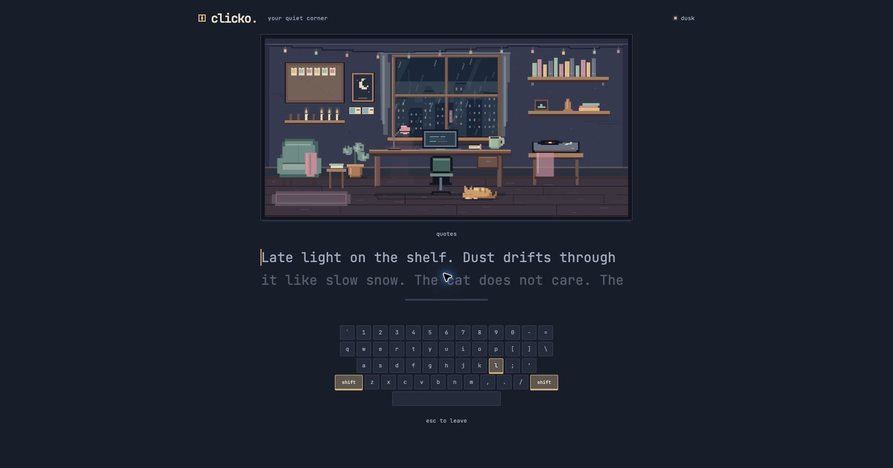

# Clicko

A cozy pixel-art typing trainer for English and Russian. Runs entirely in the browser.

**Play it: https://kritechno.github.io/clicko/**



## What it does

- Ten chapters per language, from the home row to long-form text, with a short warm-up that places you at the right level.
- Practice modes that unlock as you level up: flow, quotes, 30- and 60-second sprints, weak keys, clean hands, language switching and on-the-beat rhythm typing.
- Tracks your slowest keys and builds practice text from them.
- A room that fills with items as you progress, plus daily tasks, weekly postcards and stamps.
- Five room palettes and a shop with illustrated lamps, mugs, plants, cats and posters to make the space your own.
- Gentle room animation: a breathing sleeping cat, rain, mug steam, candles and occasional lamp flicker. Turn it off in settings; system reduced-motion preferences are respected.
- Works whichever keyboard layout is active, and tells you when to switch.
- Interface in English and Russian.

## Privacy

There is no account, no server and no tracking. Progress is saved in your browser's local storage and never leaves your device. The only external request is for the JetBrains Mono font from Google Fonts.

## Run locally

```bash
npm install
npm run dev
```

```bash
npm test
```

```bash
npm run build
```

## Music and ambience

Clicko ships without audio files. To add your own royalty-free tracks, see `public/music/README.md` and `public/ambience/README.md`.

## Stack

React 18, TypeScript, Zustand, Vite and Vitest. The typing engine in `src/engine` is framework-free and covered by unit tests.

## License

MIT
